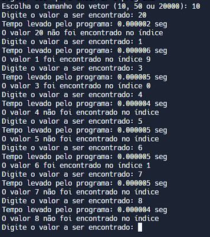
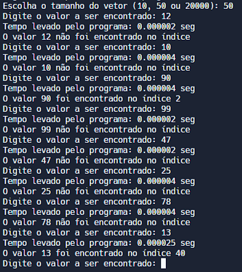
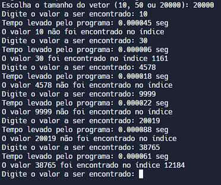

# Exercício 1

### Qual a complexidade de busca no pior caso?

Sendo n o tamanho do vetor, teremos:
O pior caso será aquele em que todo o vetor é verificado por meio da recursão, quando é necessário percorrer todo o vetor para encontrar o elemento ou confirmar que ele não está na lista.

T(n) = c + T(n-1)

T(n) = c + (c + T(n-2))

T(n) = c + (c + (c + T(n-3)))

...

T(n) = n \* c + c

Então a complexidade é linear, isto é, de O(n).

### A complexidade no pior caso é a mesma da versão iterativa?

Sim, pois na versão iterativa, para afirmar que um elemento não está na lista, ou então caso esteja no último índice do vetor, é necessário que todo o vetor seja percorrido, resultando, também, numa complexidade liner O(n), em que n é o tamanho do vetor.

### Teste o algoritmo para diferentes casos de entrada, variando o tamanho e o conteúdo do vetor.

Implementado no código com vetores de tamanho 10, 50 e 20000. O usuário diz qual o número que deseja encontrar no vetor, e terá como resultado o índice caso seja encontrando, ou -1 caso não encontre. Os números são inseridos por meio da função rand() % (2 x tamanho do array).

Testes com tamanho do vetor 10:

Testes com tamanho do vetor 50:

Testes com tamanho do vetor 20000:

