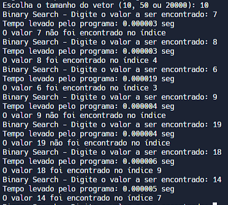
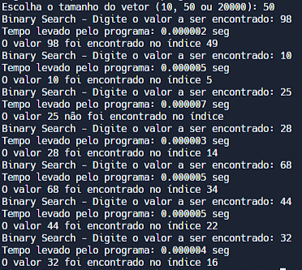
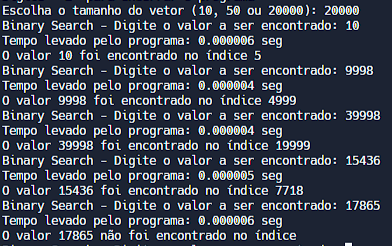

# Exercício 2

### A complexidade temporal no pior caso e melhor caso é a mesma que a versão recursiva?

Sendo n o tamanho do vetor, teremos:
O pior caso será aquele em que o trecho do vetor a ser comparado é reduzido a somente 1 elemento ou quando o elemento não está no array.

T(n) = c + T(n/2)

T(n) = c + (c + T(n/4))

T(n) = c + (c + (c + T(n/8)))

...

T(n) = n \* c + T(n/2^k)

Quando T(n/2^k) = T(1):

n/2^k = 1

2^k = n

k = log2(n)

Assim, T(n) = k _ c + T(1) = log2(n) _ c + c

A busca binária sempre divide o vetor em dois quando se está procurando, então a iteração ou recursão é realizada considerando somente metade dos elementos.

Quando o elemento que se está procurando está no meio do vetor, isto é, o melhor caso, apenas uma comparação é feita, então temos T(1) = c, resultando numa complexidade de O(1), uma complexidade constante.

O pior caso será quando for necessário dividir todo o vetor até se ter somente 1 elemento, que será o resultado. Então, consideramos o n para a função, que, como vimos acima, resulta em log2(n) \* c + c, que por sua vez tem complexidade O(log2 n), uma complexidade logarítmica.

Em relação à complexidade temporal, o funcionamento da versão iterativa e da versão recursiva é igual, com o melhor caso sendo O(1) e pior caso sendo O(log2 n).

### Qual a complexidade espacial e temporal para a versão recursiva e iterativa?

- Como apresentado na pergunta anterior, a complexidade temporal para a versão iterativa varia de O(1) até O(log2 n).
  Quanto à complexidade espacial, uma vez que não há variáveis que crescem conforme o tamanho do vetor aumenta, é possível dizer que o consumo de memória é constante, com uma complexidade espacial de O(1).

- Em relação à versão recursiva, apresentada no slide da aula "1 - Complexidade de algoritmos", pelo funcionamento semelhante à versão iterativa, no sentido de sempre "dividir" o array procurado em dois, possui complexidade temporal que varia de O(1) até O(log2 n).
  Quanto à complexidade espacial, uma vez que são alocadas variáveis locais na pilha de chamadas pra cada função recursiva chamada, a quantidade total de memória usada nessa pilha cresce conforme o tamanho do vetor, resultando numa complexidade logarítmica, isto é O(log2 n).

### Teste o algoritmo para diferentes casos de entrada, variando o tamanho e conteúdo do vetor.

Implementado no código com vetores de tamanho 10, 50 e 20000. O usuário diz qual o número que deseja encontrar no vetor, e terá como resultado o índice caso seja encontrando, ou -1 caso não encontre. Os números são inseridos com base no seus respectivos índices, com esse valor sendo multiplicado por 2.

Testes com tamanho do vetor 10:

Testes com tamanho do vetor 50:

Testes com tamanho do vetor 20000:

